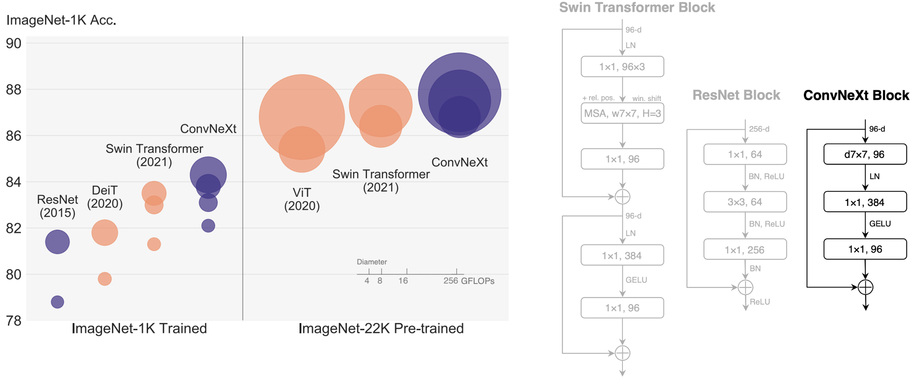
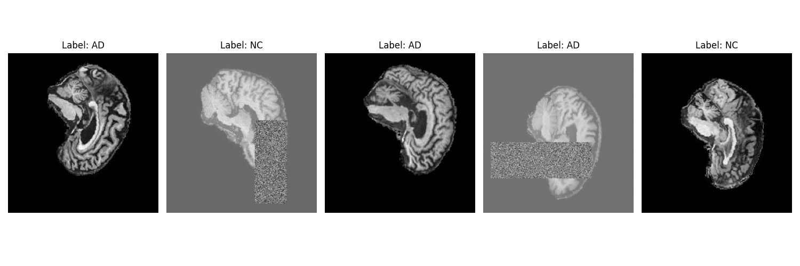
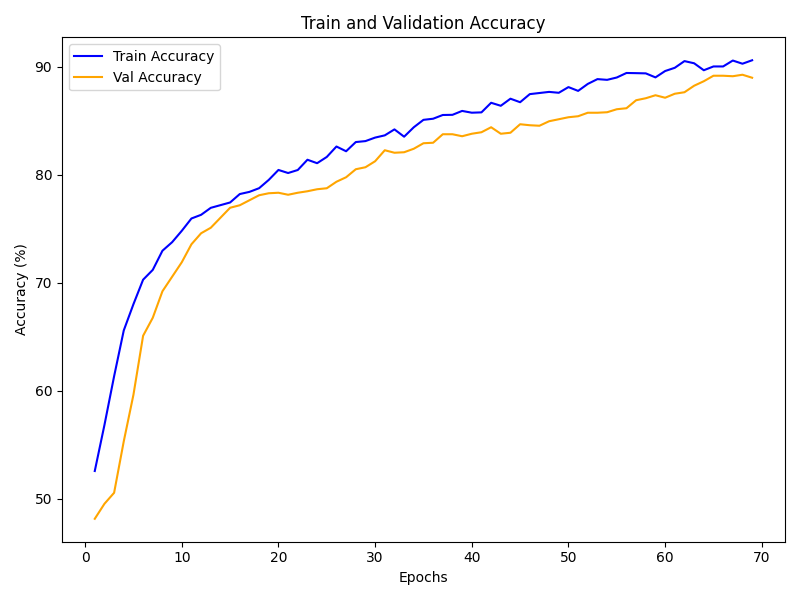
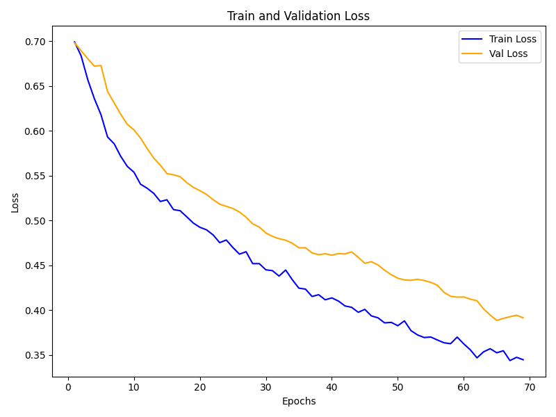
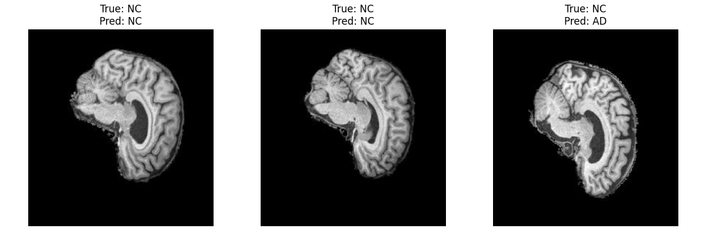
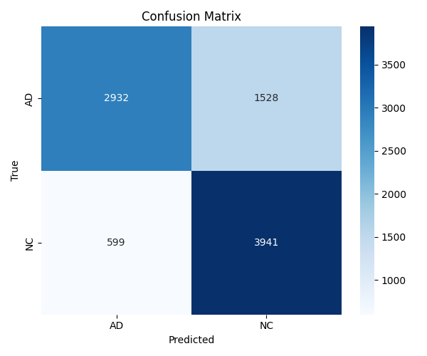

# Convnext-based Alzheimer's Classifier for the ADNI dataset
Author: Feiyang Shan

## Project Goal
This project uses the ConvNeXt architecture to classify MRI images from the ADNI dataset for detecting Alzheimer’s disease, aiming for an 80% test accuracy.

## ConvNeXt Introduction
ConvNeXt is a modern model architecture based on convolutional neural networks (CNNs), proposed by Facebook AI Research. Its design draws inspiration from new architectures such as the Vision Transformer (ViT), while optimizing and improving traditional convolutional networks to achieve performance comparable to that of the Transformer model while maintaining the efficiency and ease of use of convolutional networks.

### ConvNeXt Structure
#### Downsampling Layers
The ConvNeXt class begins with a series of downsampling layers, which progressively reduce the spatial resolution of the input image while increasing the feature dimensions. The first layer, referred to as the "stem," uses a convolutional layer with a stride of 4 to downsample the input image.
```python
stem = nn.Sequential(
    nn.Conv2d(in_chans, dims[0], kernel_size=4, stride=4),
    LayerNorm(dims[0], eps=1e-6, data_format="channels_first")
)
```
- Purpose: The stem layer reduces the input image size by a factor of 4 in both height and width, while projecting the input channels into the first feature dimension.
- LayerNorm: Normalization is applied to stabilize training and improve convergence.
Subsequent downsampling layers use a combination of LayerNorm and convolutional layers to further reduce the spatial dimensions while increasing the feature dimensions.

#### ConvNeXt Blocks
The ConvNeXtBlock class represents the core building block of the ConvNeXt architecture. Each block consists of the following components:
- Depthwise Convolution:
``` python
self.dwconv = nn.Conv2d(dim, dim, kernel_size=7, padding=3, groups=dim)
``` 
- LayerNorm:
```python
self.norm = LayerNorm(dim, eps=1e-6)
```
    - Normalization is applied in the "channels_last" format to improve computational efficiency.
- Pointwise Convolutions
```python
self.pwconv1 = nn.Linear(dim, 4 * dim)
self.pwconv2 = nn.Linear(4 * dim, dim)
```
    - Two pointwise convolutions (implemented as linear layers) are used to expand and then reduce the feature dimensions, enabling the block to learn complex feature representations.
- Activation and Residual Connection:
    - A GELU activation function is applied between the pointwise convolutions.
    - A residual connection is added to stabilize training:
```
x = input + self.drop_path(x)
```

#### Classification Head
The classification head consists of a global average pooling layer followed by a fully connected layer:
```python
self.norm = nn.LayerNorm(dims[-1], eps=1e-6)
self.head = nn.Linear(dims[-1], num_classes)
```
- Global Average Pooling: The spatial dimensions are averaged to produce a single feature vector for each image.
- Fully Connected Layer: The feature vector is mapped to the number of output classes (e.g., 2 for AD vs. NC).

#### DropPath Regularization
The DropPath class implements stochastic depth, a regularization technique that randomly skips certain blocks during training
```
self.drop_path = DropPath(drop_path) if drop_path > 0. else nn.Identity()
```
- Reduces overfitting by allowing the model to learn more robust features.
#### Predefined Configurations
The module provides several predefined configurations for different model sizes:
```python
ConvNeXt-Tiny:  
depths=[3, 3, 9, 3], dims=[96, 192, 384, 768]  
ConvNeXt-Small:  
depths=[3, 3, 27, 3], dims=[96, 192, 384, 768]  
ConvNeXt-Base:  
depths=[3, 3, 27, 3], dims=[128, 256, 512, 1024]  
```

## Dataset Structure
The ADNI dataset follows this structure:
```
AD_NC/
├── train/
│   ├── AD/
│   └── NC/
└── test/
    ├── AD/
    └── NC/
```
In `dataset.py`, the training folder is split into training and validation sets. The split is done randomly, with 90% of the training folder allocated to the training set and the remaining 10% allocated to the validation set at the start of each training session. You may change the split porportion and the seed to test different splits. In the training or validation set, MRI slices from the same patient will not appear in both the training and validation sets simultaneously to avoid data leakage caused by similar images from same patient.
```python
full_train_dataset = CustomImageDataset(TRAIN_DATA_PATH, transform=train_transform, meta_index=_meta_index)
train_idx, val_idx = split_by_patient(full_train_dataset, val_ratio=VAL_SPLIT, seed=42)

train_dataset = Subset(full_train_dataset, train_idx)
val_dataset = Subset(
    CustomImageDataset(TRAIN_DATA_PATH, transform=val_test_transform, meta_index=_meta_index),
    val_idx
)
```

### Data preprocessing
When inputting the images, I first center the brain images as much as possible based on the approximate distribution of the pixels, reducing the differences caused by varying data distributions.
```python
   @staticmethod
    def center_brain(img: Image.Image, target_size: Tuple[int, int] = (240, 256), padding_factor: float = 1.5) -> Image.Image:
        '''
        Args:
            img: PIL Image object (L mode).
            target_size: The final output image size, e.g., (224, 224). I used the original size of the image.
            padding_factor: A factor to add extra space around the brain's bounding box.
                            For example, 1.5 means adding 50% more space in each direction.
        Returns:
            Processed PIL Image object.
        '''
        img_arr = np.array(img)
        mask = img_arr > np.percentile(img_arr, 1) # Use a low percentile to determine the brain region, avoiding misidentifying lesions as background
        
        ys, xs = np.nonzero(mask)
        y_min_brain, y_max_brain = ys.min(), ys.max()
        x_min_brain, x_max_brain = xs.min(), xs.max()

        center_y = (y_min_brain + y_max_brain) / 2 # Calculate the center and size of the brain region
        center_x = (x_min_brain + x_max_brain) / 2
        height_brain = y_max_brain - y_min_brain
        width_brain = x_max_brain - x_min_brain
        
        max_brain_dim = max(height_brain, width_brain)  # Determine a new, looser crop box (centered on the brain and enlarged)
        
        crop_dim = int(max_brain_dim * padding_factor) # The side length of the new crop box, ensuring the entire brain region is included with extra space
        
        x_min_crop = int(max(0, center_x - crop_dim / 2)) # Ensure the crop box does not exceed the original image boundaries
        y_min_crop = int(max(0, center_y - crop_dim / 2))
        
        x_max_crop = int(min(img_arr.shape[1], center_x + crop_dim / 2))
        y_max_crop = int(min(img_arr.shape[0], center_y + crop_dim / 2))

        actual_crop_width = x_max_crop - x_min_crop # Actual crop dimensions
        actual_crop_height = y_max_crop - y_min_crop
        
        cropped_arr = img_arr[y_min_crop:y_max_crop, x_min_crop:x_max_crop] # Ensure the crop region is square (by further adjusting boundaries or padding)
        cropped_img = Image.fromarray(cropped_arr)

        max_side = max(cropped_img.size) # Place the cropped image at the center of the target size without changing the aspect ratio
        padded_square = ImageOps.pad(cropped_img, (max_side, max_side), color=0, centering=(0.5, 0.5))
        resized_img = padded_square.resize(target_size, Image.BILINEAR)
        
        return resized_img
```
In the training set, I used the following data augmentation techniques to improve the model's generalization ability:
```python
train_transform = transforms.Compose([
    transforms.ColorJitter(brightness=0.2, contrast=0.2), 
    transforms.RandomAffine(degrees=(-10,10), translate=(0.1, 0.1)), 
    transforms.ToTensor(),
    transforms.Normalize(mean=[MEAN], std=STD),
    transforms.RandomErasing(p=0.25, scale=(0.1, 0.2), ratio=(0.3, 3.3), value='random'),
])
``` 
For validation and test set, only normalize is used.
```
val_test_transform = transforms.Compose([
    transforms.ToTensor(),
    transforms.Normalize(mean=MEAN, std=STD),
])
```

### Data visualization
By running 
```python3 dataset.py```
A set of augmented images will be displayed. Or you can change input dataset loader to visualize val_loader's and train_loader's input images.

## Training Process
### Training conponents and Methods Used
- Optimizer：AdamW (with label smooth)
- loss function: CrossEntropyLoss
- Drop path
- Warmup
- Cosine annealing learning rate
- ~~Mixup~~
- ~~Focal Loss~~
- EMA
- Gradient Clipping
- Early stopping

I tried using the small and the base models, but they showed severe overfitting. As a result, I had to continue adjusting from the tiny model. Even in the tiny model, the overfitting issue of testset and validation set remains very severe. As a result, I added early stop and EMA to maintain the eneralization ability and with a large value of drop path. Then using ConvNeXt small to train the model. Testset will be validated after an early stop or after normal training. Through my unique center brain function, the gap between all sets hopefully reduced to improve generalization ability.
### Hyperparameters
```
BATCH_SIZE = 32 (In dataset.py)
```
```
EPOCHS = 150
BASE_LR = 2e-4 
MIN_LR = 5e-5 
WARMUP_EPOCHS = 5
WEIGHT_DECAY = 0.15
LABEL_SMOOTHING = 0.1 
DROP_PATH_RATE = 0.5 
GRAD_CLIP_NORM = 1.0 
USE_EMA = True
EVAL_WITH_EMA = True
EARLYSTOP_PATIENCE = 5
```

### Running Command
```
python3 training.py
```

### Training Results
#### Log
```
Epoch 70/150 [Train]: 100%|██████████████████████████████████████████████████████████████████| 605/605 [03:27<00:00,  19.90it/s, loss=0.4525, acc=27.50%, lr=0.000139]
Validating: 100%|███████████████████████████████████████████████████████████████████████████████████████████| 68/68 [00:12<00:00, 4.44it/s, loss=0.3090, acc=93.75%]
Classification Report:
              precision    recall  f1-score   support

          AD       0.88      0.92      0.90      1120
          NC       0.90      0.87      0.89      1040

    accuracy                           0.89      2160
   macro avg       0.89      0.89      0.89      2160
weighted avg       0.89      0.89      0.89      2160
Train    - loss: 0.3362, acc: 91.17%
Validate - loss: 0.3900, acc: 89.17%
LR: 0.000137
EarlyStopping counter: 5 out of 5
Early stopping triggered. Stopping training.
  model.load_state_dict(torch.load(ckpt_path))
Testing: 100%|████████████████████████████████████████████████████████████████████████████████████████████████████████| 282/282 [01:36<00:00, 9.17it/s, acc=100.00%]
Classification Report:
              precision    recall  f1-score   support

          AD     0.8304    0.6574    0.7338      4460
          NC     0.7206    0.8681    0.7875      4540

    accuracy                         0.7637      9000
   macro avg     0.7755    0.7627    0.7607      9000
weighted avg     0.7750    0.7637    0.7609      9000
============================================================
Total time taken: 311.19 mins
Testset accuracy: 76.37%
============================================================
```
Note: the “acc” value in logs refers to per-batch accuracy, not overall accuracy. Test set will runs once after training without using EMA weight. Just for reference.  
During the total of 150 epochs, training stopped at epoch 70 due to early stopping. At this point, the model achieved a final validation accuracy of 89.17%. The testset accyracy reaches 76.37%.
#### Loss and Accuracy
<div style="display: flex; justify-content: center; align-items: center;">
    
    
</div>


The following graphs illustrate the metrics during the training and validation phases:
- Left graph: Training accuracy (blue line) and validation accuracy (orange line)
- Right graph: Training loss (blue line) and validation loss (orange line)
The training loss (blue line) continuously decreased throughout the process, while the training accuracy (blue line) steadily increased to 91.17%, approaching saturation. The validation metrics (orange line) improved rapidly during the initial training phase (approximately the first 20 epochs).

When the training loss continued to decrease, while the validation loss reached its lowest point (around 0.39) at approximately the 60th-65th epoch and then plateaued without further improvement. This divergence indicates that the model began to overfit the training set.


## Predict Results
### Running Command
```
python3 predict.py
```
The variable NUM in `predict.py` can be modified to predict a different number of random samples. After execution, it will generate a terminal log that includes classification reprot then generate a confusion matix image. A prediction of ramdom selected will also generated. By changing `CKPT_PATH` in `predict.py`, original or EMA weight perform different. I selected `checkpoint_best.pth` this time which have a better performace. The result in Training Log only uses 'checkpoint_best.pth'. The result may different if `checkpoint_best_ema.pth` selected in prediction.
### Predict Results





```
Predicting: 100%|██████████████████████████████████████████████████████████████████████████████| 282/282 [00:44<00:00, 7.28it/s]

Classification Report:
              precision    recall  f1-score   support

          AD     0.8304    0.6574    0.7338      4460
          NC     0.7206    0.8681    0.7875      4540

    accuracy                         0.7637      9000
   macro avg     0.7755    0.7627    0.7607      9000
weighted avg     0.7750    0.7637    0.7609      9000

Confusion matrix saved as confusion_matrix.png

Test set accuracy: 76.37%

Randomly selected 3 samples for prediction:
Index 5837: True = NC, Pred = NC
Index 6777: True = NC, Pred = NC
Index 5572: True = NC, Pred = AD
Random sample predictions saved as random_predictions.png
```


## Dependencies
To reproduce this project, install the following dependencies:
- python 3.11.1
- pytorch: 2.8.1
- matplotlib: 3.10.6
- cuda:12.6
- numpy: 2.3.2
- scikit-learn: 1.7.1
- tqdm: 4.67.1

## GPU device
RTX3060 8GB

## Conclusion
The ConvNeXt-based classifier achieved a test accuracy of 76.4% on the ADNI dataset. This demonstrates the effectiveness of modern convolutional architectures in medical image classification tasks, providing a solid foundation for further research and optimization.

## References
Liu, Z., Mao, H., Wu, C.-Y., Feichtenhofer, C., Darrell, T., & Xie, S. (2022). A ConvNet for the 2020s. arXiv. https://arxiv.org/abs/2201.03545

Curry, J. (2024, August 12). ConvNeXt: A ConvNet for the 2020s – Paper Explained (with animations) [Video]. YouTube. https://www.youtube.com/watch?v=QqejV0LNDHA

GitBlog_00290. (2023, September 6). PyTorch training DQN. CSDN. https://blog.csdn.net/gitblog_00290/article/details/151787187


